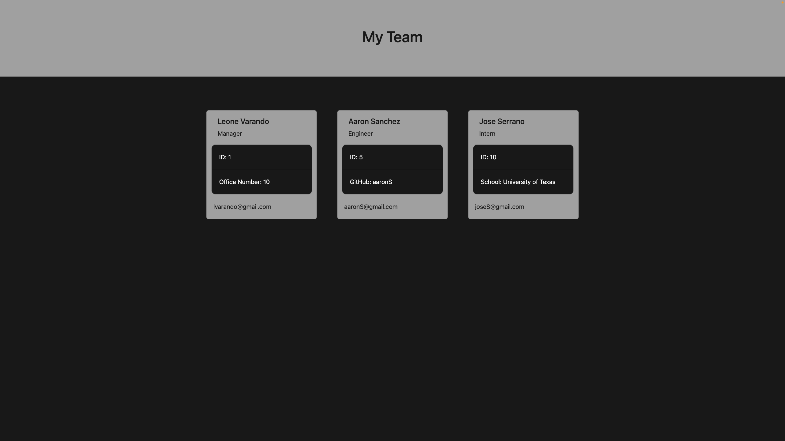
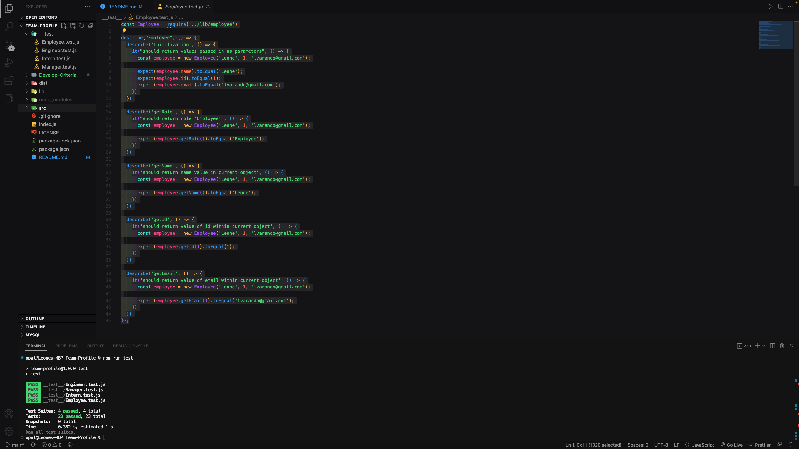

# Team-Profile
A tool to keep track of your team using Node and the Command line

## Description

This program is designed to give you a dynamic visual aid to keep track of your team and their roles. 
This program runs from the command line and asks you a series of questions that finds out the names, 
id's, emails, and other information specific to each role.

This tool uses:

    Node
    Inquirer
    Jest

## Examples

>This was the mockup given by my instuctor

>This is what I came up with

>I created tests for each of my classes

## How to Use

To begin, run node index.js in the integrated terminal inside VS Code. This will ask you a series of
questions pertinent to employee creation. Answer each question and create as many employees as you wish.
When prompted to add another employee, type 'N' to exit the inquirer loop.

When you've exited the loop, the program will then take the answers you gave and generate an html file
to cleanly display your team's information and give you links to email and github.

## How to Test

In order to test, type:

    npm run test

This will run each test within the __test__ folder and show __pass__ or __fail__ for each.

## Credits

University of Texas - Austin

[Inquirer Documentation](https://www.npmjs.com/package/inquirer)

[Stackoverflow.com](https://stackoverflow.com)

My fellow classmate, [Preston](https://github.com/chewy441014)

## License

This program is licensed under the MIT license.

For any additional questions, please refer to LICENSE file.